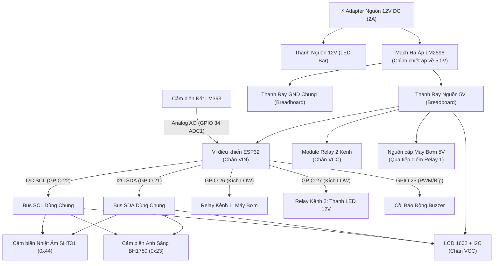

# HƯỚNG DẪN ĐẤU NỐI PHẦN CỨNG TỪ A ĐẾN Z
## DỰ ÁN NÔNG NGHIỆP THÔNG MINH AIoT (SMART AGRICULTURE)

Tài liệu này hướng dẫn chi tiết cách đấu nối toàn bộ 5 nhóm linh kiện phần cứng với vi điều khiển **ESP32 DevKit**, phân phối nguồn điện an toàn, thi công sa bàn và đồng bộ với ứng dụng React Native / Expo.

---

## MỤC LỤC
1. [Sơ Đồ Khối Kiến Trúc Hệ Thống](#1-sơ-đồ-khối-kiến-trúc-hệ-thống)
2. [Bảng Đấu Nối Chân Chi Tiết (Pinout Mapping)](#2-bảng-đấu-nối-chân-chi-tiết-pinout-mapping)
   - [2.1. Phân phối nguồn điện (Power Rails)](#21-phân-phối-nguồn-điện-power-rails)
   - [2.2. Bus I2C dùng chung (SHT31 + BH1750 + LCD 1602)](#22-bus-i2c-dùng-chung-sht31--bh1750--lcd-1602)
   - [2.3. Cảm biến độ ẩm đất (LM393)](#23-cảm-biến-độ-ẩm-đất-lm393)
   - [2.4. Module Relay 2 kênh & Còi Buzzer](#24-module-relay-2-kênh--còi-buzzer)
   - [2.5. Đấu nối thiết bị chấp hành (Máy bơm & Thanh LED 12V)](#25-đấu-nối-thiết-bị-chấp-hành-máy-bơm--thanh-led-12v)
3. [Sơ Đồ Nguyên Lý Đấu Nối Tổng Thể (Mermaid Diagram)](#3-sơ-đồ-nguyên-lý-đấu-nối-tổng-thể)
4. [Quy Trình Thi Công Từng Bước (Chuẩn Kỹ Thuật)](#4-quy-trình-thi-công-từng-bước)
5. [Hướng Dẫn Nạp Firmware ESP32 Bằng Arduino IDE](#5-hướng-dẫn-nạp-firmware-esp32)
6. [Bảng Bắt Bệnh & Xử Lý Sự Cố Thường Gặp (Troubleshooting)](#6-bảng-bắt-bệnh--xử-lý-sự-cố)

---

## 1. SƠ ĐỒ KHỐI KIẾN TRÚC HỆ THỐNG



---

## 2. BẢNG ĐẤU NỐI CHÂN CHI TIẾT (PINOUT MAPPING)

### 2.1. Phân phối nguồn điện (Power Rails)
> [!CAUTION]
> **QUY TẮC SỐNG CÒN:** Không bao giờ cắm trực tiếp 12V vào ESP32! Phải qua mạch hạ áp LM2596 và đo thử bằng đồng hồ vạn năng hoặc màn hình LED trên LM2596 đạt đúng **5.0V** rồi mới cắm vào ESP32.

| Nguồn / Mạch | Chân trên mạch | Nối tới đâu | Ghi chú |
| :--- | :--- | :--- | :--- |
| **Adapter 12V** | Dây Dương (+) | `IN+` của LM2596 & Chân `COM` Kênh Relay 2 (Đèn LED) | Dây đỏ |
| **Adapter 12V** | Dây Âm (-) | `IN-` của LM2596 & Thanh Ray `GND` Breadboard | Dây đen (Chung Mass) |
| **LM2596 (Sau chỉnh 5V)** | `OUT+` (5.0V) | Thanh Ray Đỏ `(+)` của Breadboard | Cấp nguồn 5V cho toàn mạch |
| **LM2596 (Sau chỉnh 5V)** | `OUT-` (GND) | Thanh Ray Xanh `(-)` của Breadboard | Cực âm chung (GND) |
| **ESP32 DevKit** | `VIN` (hoặc `5V`) | Thanh Ray Đỏ `(+)` 5V Breadboard | Nguồn nuôi ESP32 |
| **ESP32 DevKit** | `GND` | Thanh Ray Xanh `(-)` GND Breadboard | Nối mass chung |

---

### 2.2. Bus I2C dùng chung (SHT31 + BH1750 + LCD 1602)
Cả 3 module đều dùng chuẩn giao tiếp I2C. ESP32 chỉ cần **2 chân GPIO** để giao tiếp với cả 3 thiết bị nhờ địa chỉ phần cứng khác nhau:
- **SHT31:** Địa chỉ `0x44`
- **BH1750:** Địa chỉ `0x23`
- **LCD 1602 I2C:** Địa chỉ `0x27` (hoặc `0x3F`)

| Module | Chân Module | Chân ESP32 / Breadboard | Màu dây khuyến nghị |
| :--- | :--- | :--- | :--- |
| **SHT31** | `VIN` | Thanh Ray 5V (hoặc chân 3V3 của ESP32) | Đỏ |
| **SHT31** | `GND` | Thanh Ray GND | Đen |
| **SHT31** | `SDA` | **GPIO 21** của ESP32 | Xanh lá |
| **SHT31** | `SCL` | **GPIO 22** của ESP32 | Vàng |
| **BH1750** | `VCC` | Thanh Ray 5V (hoặc chân 3V3 của ESP32) | Đỏ |
| **BH1750** | `GND` | Thanh Ray GND | Đen |
| **BH1750** | `SDA` | **GPIO 21** của ESP32 (cắm chung hàng với SHT31) | Xanh lá |
| **BH1750** | `SCL` | **GPIO 22** của ESP32 (cắm chung hàng với SHT31) | Vàng |
| **BH1750** | `ADDR` | Để trống (Mặc định địa chỉ 0x23) | Không cần cắm |
| **LCD 1602 I2C** | `VCC` | Thanh Ray 5V Breadboard (LCD cần đúng 5V để rõ nét) | Đỏ |
| **LCD 1602 I2C** | `GND` | Thanh Ray GND Breadboard | Đen |
| **LCD 1602 I2C** | `SDA` | **GPIO 21** của ESP32 (cắm chung hàng I2C) | Xanh lá |
| **LCD 1602 I2C** | `SCL` | **GPIO 22** của ESP32 (cắm chung hàng I2C) | Vàng |

---

### 2.3. Cảm biến độ ẩm đất (LM393)
Gồm 2 phần: Chạc kim loại chữ U cắm vào đất và Board so sánh LM393 (HW-103).

| Vị trí | Chân Module | Chân kết nối | Ghi chú |
| :--- | :--- | :--- | :--- |
| **Chạc chữ U** | 2 chân kim | 2 chân đầu vào của board LM393 | Dùng 2 dây cắm nối trực tiếp |
| **Board LM393** | `VCC` | Thanh Ray 5V (hoặc 3V3) Breadboard | Đỏ |
| **Board LM393** | `GND` | Thanh Ray GND Breadboard | Đen |
| **Board LM393** | `AO` (Analog Output) | **GPIO 34 (ADC1_CH6)** của ESP32 | Dây cam / tím |
| **Board LM393** | `DO` (Digital Output)| Để trống | Không dùng chân DO |

> [!TIP]
> **Tại sao dùng GPIO 34?**
> ESP32 có 2 bộ chuyển đổi ADC (ADC1 và ADC2). Khi bật Wi-Fi, toàn bộ các chân thuộc nhóm ADC2 (GPIO 0, 2, 4, 12-15, 25-27) sẽ bị khóa/nhiễu. Do đó, cắm cảm biến Analog vào **GPIO 34 (thuộc ADC1)** là lựa chọn chuẩn kỹ thuật nhất!

---

### 2.4. Module Relay 2 kênh 5V & Còi Buzzer

| Module | Chân Module | Nối tới đâu | Ghi chú |
| :--- | :--- | :--- | :--- |
| **Relay 2 Kênh** | `VCC` | Thanh Ray 5V Breadboard | Đỏ |
| **Relay 2 Kênh** | `GND` | Thanh Ray GND Breadboard | Đen |
| **Relay 2 Kênh** | `IN1` | **GPIO 26** của ESP32 | Điều khiển Máy Bơm nước |
| **Relay 2 Kênh** | `IN2` | **GPIO 27** của ESP32 | Điều khiển Thanh LED 12V |
| **Còi Buzzer** | Chân Dương `(+)` / `I/O` | **GPIO 25** của ESP32 | Tín hiệu phát âm thanh |
| **Còi Buzzer** | Chân Âm `(-)` / `GND` | Thanh Ray GND Breadboard | Nối mass chung |

---

### 2.5. Đấu nối thiết bị chấp hành (Máy bơm & Thanh LED 12V)
Relay hoạt động như một công tắc cơ học ngắt/nối một dây nguồn của thiết bị:
- **`COM` (Common):** Chân chung.
- **`NO` (Normally Open):** Thường mở (khi ESP32 kích hoạt thì đóng mạch cho dòng điện chạy qua).
- **`NC` (Normally Closed):** Thường đóng (không dùng).

#### A. Đấu nối Máy Bơm Chìm Mini (Loại 5V DC phổ biến):
1. Dây đen (Âm -) của Máy bơm $\rightarrow$ Cắm thẳng vào thanh ray **GND** Breadboard.
2. Dây đỏ (Dương +) của Máy bơm $\rightarrow$ Cắm vào chân **`NO1`** của Relay Kênh 1.
3. Chân **`COM1`** của Relay Kênh 1 $\rightarrow$ Cắm vào thanh ray **5V** Breadboard.

*(Nếu dùng loại Bơm 12V: Nối COM1 vào nguồn 12V thay vì 5V)*

#### B. Đấu nối Thanh LED Cứng 12V:
1. Dây âm (-) của Thanh LED $\rightarrow$ Nối thẳng vào nguồn **Âm (-) của Adapter 12V** (hoặc GND chung).
2. Dây dương (+) của Thanh LED $\rightarrow$ Cắm vào chân **`NO2`** của Relay Kênh 2.
3. Chân **`COM2`** của Relay Kênh 2 $\rightarrow$ Cắm vào nguồn **Dương (+) 12V của Adapter**.

---

## 3. SƠ ĐỒ ĐI DÂY THỰC TẾ CHI TIẾT

```text
                        ┌──────────────────────────────────────────────────┐
                        │              ADAPTER NGUỒN 12V DC                │
                        └───────┬──────────────────────────┬───────────────┘
                           +12V │                      GND │
                                ▼                          ▼
                        ┌──────────────┐          ┌─────────────────┐
                        │   LM2596     │          │                 │
                        │ IN+      IN- │          │                 │
                        │              │          │                 │
                        │OUT+     OUT- │          │                 │
                        └──┬───────┬───┘          │                 │
                      +5.0V│   GND │              │                 │
                           ▼       ▼              │                 │
   ═══════════════════════════════════════════════╧═════════════════╧═══════════
   BREADBOARD:   [ + ]  Ray Đỏ (+5.0V cấp từ OUT+ của LM2596)
                 [ - ]  Ray Xanh (GND chung nối OUT- LM2596 và Adapter)
   ═════════════════════════════════════════════════════════════════════════════
                   │   │         │   │        │   │        │   │
                   │   │         │   │        │   │        │   │
                   ▼   ▼         ▼   ▼        ▼   ▼        ▼   ▼
               ┌──────────┐   ┌─────────┐  ┌────────┐  ┌────────────┐
               │  ESP32   │   │  SHT31  │  │ BH1750 │  │  LCD 1602  │
               │ VIN  GND │   │ VIN GND │  │VCC GND │  │ VCC   GND  │
               └────┬─────┘   └──┬───┬──┘  └──┬──┬──┘  └───┬────┬───┘
                    │            │   │        │  │         │    │
       GPIO 21 (SDA)├────────────┴───┼────────┴──┼─────────┴────┼────── (Bus SDA)
       GPIO 22 (SCL)├────────────────┴───────────┴──────────────┴────── (Bus SCL)
                    │
       GPIO 34 (A0) ├───────────────────────── AO ── [ LM393 Cảm Biến Đất ]
                    │
       GPIO 26 ─────┼───────────────────────── IN1 ──┐
       GPIO 27 ─────┼───────────────────────── IN2 ──┤ [ Module Relay 2 Kênh ]
                    │                                │ VCC -> +5V, GND -> GND
       GPIO 25 ─────┼─── (+) [ Buzzer ] (-) -> GND   │
                    │                                └──┬───────┬───────┐
                    │                                   │       │       │
                                                       NO1     COM1    NO2    COM2
                                                        │       │       │      │
                                                        │      +5V      │     +12V
                                                        ▼               ▼
                                                   [MÁY BƠM 5V]    [ĐÈN LED 12V]
                                                    (-) -> GND      (-) -> GND
```

---

## 4. QUY TRÌNH THI CÔNG TỪNG BƯỚC (CHUẨN KỸ THUẬT)

### Bước 1: Cắt formex & định hình khung sa bàn
- Dùng tấm Formex 5mm cắt hình chữ nhật kích thước khoảng **30cm x 40cm** làm đế chịu lực.
- Chia sa bàn thành 2 khu vực:
  - **Khu vực trồng trọt (60% diện tích):** Đặt chậu cây cảnh nhỏ, cắm chạc cảm biến độ ẩm đất, bố trí ống ti-ô dẫn nước từ máy bơm.
  - **Khu vực kỹ thuật điện (40% diện tích):** Đặt Breadboard, ESP32, Relay, LM2596 và LCD 1602.
- Làm một cột đứng bằng formex (cao khoảng 20-25cm) bắc ngang qua chậu cây để gắn **Thanh LED cứng 12V** chiếu sáng từ trên xuống và gắn cảm biến **BH1750** hứng sáng.

### Bước 2: Chuẩn bị nguồn điện & kiểm tra điện áp (BẮT BUỘC)
1. Cắm jack nguồn Adapter 12V vào 2 chân `IN+` và `IN-` của mạch hạ áp LM2596.
2. Nhìn vào màn hình LED 7 đoạn trên mạch LM2596 (nhấn nút nhỏ bên cạnh để màn hình hiển thị điện áp đầu ra `OUT`).
3. Dùng tua vít 2 cạnh nhỏ vặn ốc chiết áp màu vàng:
   - Vặn **ngược chiều kim đồng hồ** từ 5–15 vòng cho đến khi màn hình hiển thị chính xác **5.0V**.
4. Rút Adapter ra trước khi tiến hành cắm dây sang ESP32!

### Bước 3: Đấu dây nguồn lên Breadboard
1. Nối dây từ `OUT+` (5.0V) của LM2596 vào đường ray đỏ `(+)` của Breadboard.
2. Nối dây từ `OUT-` (GND) của LM2596 vào đường ray xanh `(-)` của Breadboard.
3. Cắm chân `VIN` của ESP32 vào ray đỏ, chân `GND` của ESP32 vào ray xanh.

### Bước 4: Đấu nối cảm biến & màn hình LCD (Bus I2C)
1. Dùng Breadboard tạo 2 cầu nối: một cột cho **SDA (GPIO 21)** và một cột cho **SCL (GPIO 22)**.
2. Lần lượt cắm chân SDA của SHT31, BH1750, LCD vào cột SDA.
3. Lần lượt cắm chân SCL của SHT31, BH1750, LCD vào cột SCL.
4. Cấp nguồn 5V và GND từ 2 thanh ray Breadboard cho cả 3 thiết bị.

### Bước 5: Đấu nối cảm biến đất & Relay & Còi
1. Nối chân `AO` của board cảm biến đất LM393 vào **GPIO 34**. Cắm 2 dây từ chạc chữ U vào 2 chân đầu vào của LM393.
2. Nối chân `IN1` của Relay vào **GPIO 26**, chân `IN2` vào **GPIO 27**.
3. Nối chân dương còi Buzzer vào **GPIO 25**, chân âm vào ray GND.

### Bước 6: Đấu nối tải công suất & kiểm tra cơ khí
1. Luồn ống ti-ô vào đầu ra của máy bơm mini. Cố định đầu còn lại của ống vào mép chậu cây bằng lạt nhựa (dây thút).
2. Đặt máy bơm vào một hộp nhựa nhỏ hoặc cốc nước giả lập bể chứa nước ngầm.
3. Dán thanh LED 12V lên giàn treo phía trên chậu cây.

---

## 5. HƯỚNG DẪN NẠP FIRMWARE ESP32 BẰNG ARDUINO IDE

File mã nguồn hoàn chỉnh đã được cấu hình sẵn tại:
📁 [`firmware/esp32_aiot_agriculture/esp32_aiot_agriculture.ino`](file:///d:/WebsiteAppFullProject/IOT/firmware/esp32_aiot_agriculture/esp32_aiot_agriculture.ino)

### Bước 1: Cài đặt thư viện cần thiết trong Arduino IDE
Mở **Arduino IDE** $\rightarrow$ chọn **Tools** $\rightarrow$ **Manage Libraries...** (hoặc `Ctrl + Shift + I`), tìm và bấm **Install** các thư viện sau:
1. `Adafruit SHT31 Library` (bởi Adafruit)
2. `BH1750` (bởi Christopher Laws)
3. `LiquidCrystal I2C` (bởi Frank de Brabander hoặc Marco Schwartz)
4. `ArduinoJson` (bởi Benoit Blanchon — **chọn phiên bản 6.x**)

### Bước 2: Cấu hình thông tin Wi-Fi
Mở file `esp32_aiot_agriculture.ino`, tìm dòng 19 và 20:
```cpp
const char* WIFI_SSID = "TEN_WIFI_NHA_BAN";      // Thay tên Wi-Fi
const char* WIFI_PASSWORD = "MAT_KHAU_WIFI";     // Thay mật khẩu
```
*(Lưu ý: ESP32 chỉ kết nối được sóng Wi-Fi băng tần 2.4GHz, không dùng mạng Wi-Fi 5GHz).*

### Bước 3: Cắm cáp Micro-USB và nạp code
1. Chọn Board: **Tools** $\rightarrow$ **Board** $\rightarrow$ **ESP32 Arduino** $\rightarrow$ **ESP32 Dev Module**.
2. Chọn cổng COM tương ứng của ESP32 tại **Tools** $\rightarrow$ **Port**.
3. Bấm nút **Upload** (mũi tên trỏ sang phải $\rightarrow$).
4. Khi màn hình Console hiện chữ `Connecting........____`, hãy **nhấn giữ nút BOOT** trên mạch ESP32 khoảng 1–2 giây rồi thả ra để chip vào chế độ nhận nạp.

### Bước 4: Nhận địa chỉ IP
Sau khi nạp xong:
- Còi buzzer sẽ kêu bíp 2 tiếng báo hiệu thành công.
- Màn hình **LCD 1602** hiển thị:
  ```text
  WiFi Connected!
  192.168.1.xxx
  ```
- Hoặc mở **Serial Monitor** (tốc độ `115200 baud`) để xem dòng IP:
  ```text
  >> ĐỊA CHỈ IP ESP32 CỦA BẠN: 192.168.1.15
  ```

### Bước 5: Cấu hình trên App React Native / Expo
Mở file [`services/api.ts`](file:///d:/WebsiteAppFullProject/IOT/services/api.ts) trong project:
```typescript
const USE_MOCK = false; // Đổi thành false để kết nối mạch thật
const ESP32_BASE_URL = 'http://192.168.1.15/api'; // Thay IP thực tế của ESP32
```
Bây giờ mở app lên, toàn bộ dữ liệu cảm biến thực, điều khiển bật/tắt bơm/đèn và chẩn đoán AI theo cây trồng sẽ hoạt động đồng bộ với sa bàn!

---

## 6. BẢNG BẮT BỆNH & XỬ LÝ SỰ CỐ THƯỜNG GẶP (TROUBLESHOOTING)

| Hiện tượng | Nguyên nhân | Cách khắc phục triệt để |
| :--- | :--- | :--- |
| **Màn hình LCD 1602 chỉ sáng đèn xanh nhưng không hiện chữ** | Biến trở chỉnh độ tương phản (Contrast) phía sau module I2C chưa đúng nấc | Lấy tua vít vặn nhẹ núm chiết áp màu xanh chi chít ở mặt lưng mạch I2C của LCD cho tới khi chữ hiện rõ nét. |
| **Serial Monitor báo `[CẢNH BÁO] Không tìm thấy SHT31`** | Chưa hàn 4 chân kim của SHT31 hoặc lỏng dây SDA/SCL | 1. Kiểm tra lại mối hàn thiếc 4 chân SHT31 (nhiều bạn chỉ cắm hờ không hàn dẫn đến không tiếp xúc điện).<br>2. Đổi chéo lại dây SDA (GPIO 21) và SCL (GPIO 22). |
| **ESP32 bị sập nguồn / khởi động lại (Brownout) khi bật Máy Bơm** | Nguồn 5V bị sụt áp đột ngột do mô-tơ máy bơm tiêu thụ dòng khởi động lớn | 1. Đảm bảo nguồn cấp lấy từ mạch LM2596 (không lấy nguồn từ chân 3V3 của ESP32).<br>2. Vặn chiết áp LM2596 lên mức **5.1V – 5.2V** để bù sụt áp đường dây.<br>3. Đấu thêm 1 tụ hóa $100\mu\text{F} - 470\mu\text{F}$ (16V) song song vào 2 cực nguồn Breadboard. |
| **Độ ẩm đất luôn báo 0% hoặc 100% không đổi** | Cắm nhầm chân DO thay vì AO, hoặc chạc cắm chưa tiếp xúc đất | 1. Đảm bảo dây nối vào chân **`AO`** trên board LM393 (chân DO chỉ là công tắc ngưỡng bật/tắt).<br>2. Cắm chạc kim ngập ít nhất 2/3 chiều dài vào đất ẩm. |
| **Relay đèn đỏ sáng nhưng máy bơm/đèn không chạy** | Tiếp điểm Relay đấu nhầm chân hoặc chưa cấp nguồn cho tải | Kiểm tra lại: Dây dương nguồn phải đi vào chân `COM`, dây ra tải nối vào chân `NO`. Cả 2 dây nguồn âm và dương phải khép kín mạch với thiết bị. |
| **App điện thoại báo lỗi không kết nối được tới ESP32** | Điện thoại và ESP32 đang ở 2 mạng Wi-Fi khác nhau | Đảm bảo điện thoại đang kết nối vào **cùng một mạng Wi-Fi 2.4GHz** với ESP32 (không dùng mạng 4G/5G của điện thoại). |
