# HỆ THỐNG QUẢN LÝ CHUYÊN CANH NÔNG NGHIỆP DƯA LƯỚI THÔNG MINH (AIoT)
*(Smart High-Tech Melon Farming Management System)*

---

## 1. MỤC ĐÍCH & TÍNH CẤP THIẾT CỦA ĐỒ ÁN

### 1.1. Tại sao lựa chọn chuyên canh Dưa Lưới (Cucumis melo)?
- **Giá trị kinh tế cao:** Dưa lưới là nông sản chủ lực trong các mô hình nông nghiệp công nghệ cao tại Việt Nam. Nông dân đầu tư nhà màng có thể thu hoạch từ 2 đến 3 vụ/năm, mang lại doanh thu hàng trăm triệu đồng/sào.
- **Yêu cầu kiểm soát vi khí hậu khắt khe:**
  - **Giai đoạn thụ phấn (Ngày 13 - 35):** Đòi hỏi độ ẩm không khí 65 - 70%, nhiệt độ 26 - 30°C. Nếu quá ẩm (>85%), hạt phấn bị bết dính, hoa không đậu quả.
  - **Giai đoạn lên vân lưới & tạo ngọt (Ngày 36 - 65):** Cần ánh sáng quang hợp mạnh và biên độ ẩm đất dao động chuẩn (60 - 65%). Thừa nước đột ngột sẽ làm **nứt toác vỏ quả**, giảm giá trị thương phẩm; thiếu sáng sẽ làm dưa bị nhạt (không đạt độ ngọt Brix ≥ 14%).
  - **Giai đoạn cắt nước thu hoạch (Ngày 66 - 75):** Cần siết nước tưới xuống 45 - 52% để dưa cô đọng lượng đường tối đa.
- **Đóng góp của đồ án:** Thay thế kinh nghiệm cảm tính của người làm vườn bằng các thuật toán điều tiết vi khí hậu chính xác (Precision Agriculture), tối ưu năng suất và đảm bảo chất lượng trái dưa đạt chuẩn xuất khẩu.

---

## 2. GIẢI QUYẾT CÁC BÀI TOÁN KỸ THUẬT & GÓP Ý CỦA HỘI ĐỒNG

### 2.1. Cảm biến ánh sáng (BH1750) dùng để làm gì?
- **Khái niệm then chốt:** Không dùng cảm biến ánh sáng chỉ để nhận biết ngày/đêm, mà ứng dụng để tính toán **DLI (Daily Light Integral - Tích phân ánh sáng hàng ngày)**.
- **Tác động nông sinh học:** Dưa lưới cần tích lũy quang hợp tối thiểu 25 - 30 mol/m²/ngày để chuyển hóa đường saccharose vào quả.
- **Ứng dụng điều khiển:** Khi trời âm u, mùa mưa bão kéo dài khiến chỉ số Lux từ cảm biến BH1750 giảm dưới ngưỡng tối ưu (< 20.000 lx), hệ thống sẽ:
  1. Cảnh báo nguy cơ thâm hụt DLI trên ứng dụng di động.
  2. Tự động kích hoạt **Đèn LED quang hợp chuyên dụng** bổ sung trong 3 - 4 giờ, đảm bảo dưa đủ năng lượng tạo đường Brix.

### 2.2. Bài toán Cảm biến Mưa & Tích hợp Dự báo Thời tiết (Rain Inhibit)
- **Vấn đề thực tế:** Khi đất đang khô (cảm biến báo thiếu ẩm), bơm chuẩn bị kích hoạt tưới. Tuy nhiên nếu ngoài trời sắp có mưa to (>60%), việc tiếp tục tưới sẽ làm giá thể trong bầu ngập úng, thối rễ tơ và nứt quả dưa.
- **Giải pháp tích hợp:**
  - **Phần cứng:** Cảm biến mưa (Rain Sensor) phát hiện nước mưa bề mặt tức thời.
  - **Phần mềm:** Tích hợp API dự báo thời tiết theo thời gian thực (Open-Meteo API) lấy xác suất mưa trong các giờ tiếp theo.
  - **Logic điều tiết:** Khi phát hiện mưa hoặc `Xác suất mưa ≥ 60%`, hệ thống tự động kích hoạt chế độ **Rain Safe Lock**: Khóa van tưới tự động, hoãn chu kỳ tưới để đón lượng nước tự nhiên, bảo vệ tối đa bộ rễ dưa.

### 2.3. Bài toán Khử Xung Đột Bơm Tự Động vs Bấm Nút Thủ Công (Smart Override)
- **Vấn đề xung đột:** Nếu hệ thống chạy tự động theo lịch/cảm biến, nhưng người dùng vào App bấm nút tắt thủ công, các vòng lặp thông thường sẽ lập tức bật lại sau 1-2 giây, gây hiện tượng đóng ngắt liên tục (chập cheng, rè rơ-le, cháy bơm).
- **Thuật toán Smart Override (Giải pháp cốt lõi):**
  1. **Hai chế độ phân cấp:**
     - **TỰ ĐỘNG (SMART AUTO):** Hệ thống quyết định đóng ngắt theo độ ẩm đất, ngưỡng VPD và dự báo thời tiết.
     - **THỦ CÔNG (MANUAL):** Toàn quyền kiểm soát trực tiếp từ người dùng.
  2. **Cơ chế Ghi Đè Ưu Tiên (User-Priority Override):**
     - Khi đang ở chế độ `AUTO`, nếu người dùng chủ động bấm nút On/Off thiết bị trên App, hệ thống ghi nhận sự can thiệp của con người và kích hoạt cờ `OverrideUntil = Now + 30 phút`.
     - Trong 30 phút này, **toàn bộ thuật toán tự động bị đình chỉ** đối với thiết bị đó. Bơm giữ nguyên trạng thái theo lệnh người dùng vừa ấn, triệt tiêu 100% nguy cơ xung đột lịch trình.
     - Người dùng có thể nhấn nút **"Khôi phục Auto"** trên giao diện bất cứ lúc nào để trả quyền lại cho hệ thống tự động.

### 2.4. Vấn đề Còi Buzzer vật lý
- **Đánh giá khách quan:** Còi buzzer gắn ngoài vườn rộng không đem lại giá trị thực tế do tiếng ồn môi trường và người nông dân không túc trực 24/7 bên cạnh mạch vi điều khiển.
- **Cải tiến:** Loại bỏ sự phụ thuộc vào còi vật lý, thay thế bằng **Notification Banner thời gian thực & Push Notification** gửi thẳng về smartphone của chủ vườn khi có biến động bất thường (nhiệt độ vượt 35°C, nguy cơ nấm phấn trắng khi độ ẩm >85%).

---

## 3. KIẾN TRÚC HỆ THỐNG TOÀN DIỆN (3-TIER AIoT ARCHITECTURE)

```mermaid
graph TD
    subgraph "1. Lớp Thiết Bị Biên (Edge / Hardware)"
        ESP32["Vi điều khiển ESP32 WROOM-32"]
        DHT["Cảm biến Nhiệt Ẩm DHT22 AM2302 (1-Wire GPIO 4)"]
        BH1750["Cảm biến Ánh sáng BH1750 GY-302 (I2C SDA 21 / SCL 22)"]
        RAIN["Cảm biến Mưa Raindrops (Digital DO GPIO 32)"]
        SOIL["Cảm biến Độ ẩm đất (Analog GPIO 35 - ADC1)"]
        LCD["Màn hình LCD 1602 I2C (SDA 21 / SCL 22)"]
        RELAY["Module Relay Cách Ly 2 Kênh (GPIO 26 / 27)"]
        PUMP["Máy bơm tưới nhỏ giọt"]
        LIGHT["Đèn LED quang hợp chuyên dụng"]
        
        ESP32 -->|1-Wire| DHT
        ESP32 -->|I2C| BH1750
        ESP32 -->|ADC1| SOIL
        ESP32 -->|GPIO In| RAIN
        ESP32 -->|I2C| LCD
        ESP32 -->|GPIO Out| RELAY
        RELAY --> PUMP
        RELAY --> LIGHT
    end

    subgraph "2. Lớp Truyền Tải (Cloud Messaging)"
        MQTT["HiveMQ Cloud Broker (TLS/SSL Port 8883)"]
        TOPIC_SENSORS["Topic: farm/sensors"]
        TOPIC_CONTROL["Topic: farm/control/*"]
        TOPIC_STATE["Topic: farm/state/*"]
        
        ESP32 <-->|MQTT Pub/Sub| MQTT
        MQTT --- TOPIC_SENSORS
        MQTT --- TOPIC_CONTROL
        MQTT --- TOPIC_STATE
    end

    subgraph "3. Lớp Ứng Dụng & Trí Tuệ Nhân Tạo (App & AI)"
        APP["Ứng dụng Mobile React Native (Expo)"]
        WEATHER_API["Open-Meteo Weather API"]
        AI_ENGINE["Hybrid AI: Gemini Flash + Groq + Agronomy Rules"]
        VPD_CALC["Bộ tính toán VPD & Nhu cầu bốc thoát hơi nước"]
        OVERRIDE_MGR["Smart Pump Override & Chống xung đột"]
        
        MQTT <-->|WebSocket SSL| APP
        APP <--> WEATHER_API
        APP --> VPD_CALC
        APP --> AI_ENGINE
        APP --> OVERRIDE_MGR
    end
```

---

## 4. BẢNG THÔNG SỐ VÀNG CHO VỤ DƯA LƯỚI 75 NGÀY

| Giai đoạn | Số ngày | Nhiệt độ (°C) | Độ ẩm KK (%) | Độ ẩm đất (%) | Ánh sáng (Lux) | VPD tối ưu (kPa) | Chỉ dẫn kỹ thuật |
| :--- | :---: | :---: | :---: | :---: | :---: | :---: | :--- |
| **1. Cây con vườn ươm** | 1 - 12 | 24 - 28 | 70 - 80 | 70 - 75 | 12.000 - 22.000 | 0.6 - 0.8 | Bảo vệ rễ tơ, tránh ánh nắng gắt trực tiếp buổi trưa. |
| **2. Thụ phấn & Tuyển trái** | 13 - 35 | 26 - 30 | 65 - 70 | 65 - 72 | 30.000 - 48.000 | 0.95 - 1.2 | Thụ phấn 7h-9h30 sáng; tuyển 1 quả duy nhất ở nách lá 10-12. |
| **3. Lên vân lưới & Tích đường** | 36 - 65 | 27 - 31 | 60 - 65 | 60 - 65 | 32.000 - 50.000 | 1.1 - 1.35 | Bù sáng quang hợp (DLI), giữ ẩm ổn định để lưới rạn đều không nứt. |
| **4. Siết nước & Thu hoạch** | 66 - 75 | 25 - 29 | 55 - 62 | 45 - 52 | 25.000 - 42.000 | 1.2 - 1.45 | Cắt giảm 50% nước tưới 7 ngày cuối để đạt độ ngọt Brix ≥ 14%. |

---

## 5. TỔNG KẾT CODEBASE DỰ ÁN

- `app/(tabs)/index.tsx`: Dashboard theo dõi vi khí hậu thời gian thực, tích hợp Banner dự báo thời tiết và khuyến nghị tưới thông minh.
- `app/(tabs)/control.tsx`: Trung tâm điều khiển thiết bị Relay, tích hợp bộ chuyển đổi chế độ `AUTO / MANUAL`, cơ chế **Smart Override (30 phút)** và tính năng **Rain Safe Lock**.
- `app/(tabs)/ai.tsx`: Trợ lý AI Nông học chuyên sâu Dưa lưới, hỗ trợ phân tích đa tầng (Gemini Flash $\rightarrow$ Groq Cloud $\rightarrow$ Local Heuristics).
- `components/ActiveCropBanner.tsx`: Thẻ theo dõi tiến độ sinh trưởng 75 ngày của Dưa lưới với chỉ dẫn kỹ thuật từng giai đoạn.
- `services/weather.ts`: Kết nối dịch vụ Open-Meteo cung cấp nhiệt độ, độ ẩm ngoài trời và xác suất mưa.
- `utils/agronomy.ts`: Công thức Nông học chuẩn quốc tế tính toán VPD dựa trên phương trình Tetens.
